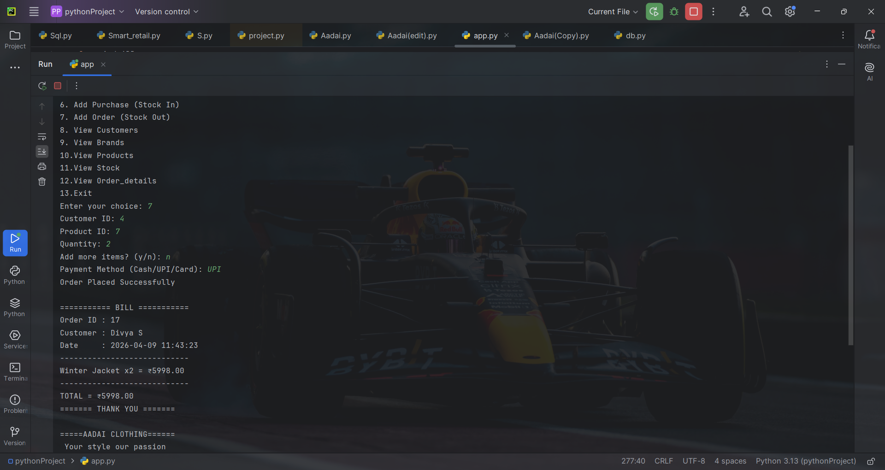
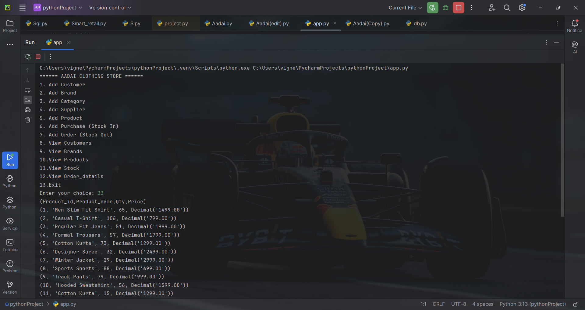
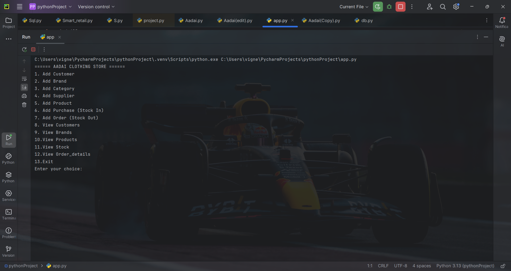

# 🛍️ Retail Inventory Management System (SQL + Python)

## 🔹 Overview
This project is a console-based inventory and billing system built using Python and MySQL.

It manages customers, products, stock, purchases, and orders with real-time inventory updates.

## 🔹 Features
- Customer Management
- Product & Brand Management
- Purchase (Stock In)
- Order Processing (Stock Out)
- Payment Tracking
- Auto Billing System
- Real-time Inventory Update

## 🔹 Tech Stack
- Python
- MySQL
- SQL Queries

## 🔹 Workflow
1. Add Products & Categories
2. Add Stock via Purchases
3. Place Orders
4. Generate Bill
5. Update Inventory Automatically

## 🔹 Key Highlights
- Real-time stock update
- Relational database design
- End-to-end business flow implementation

## 🔹 Sample Output

### 🧾 Billing Output

### 📦 Stock View

### 📋 Menu

## 🔹 Conclusion
A complete retail inventory and billing system built using Python and MySQL.
